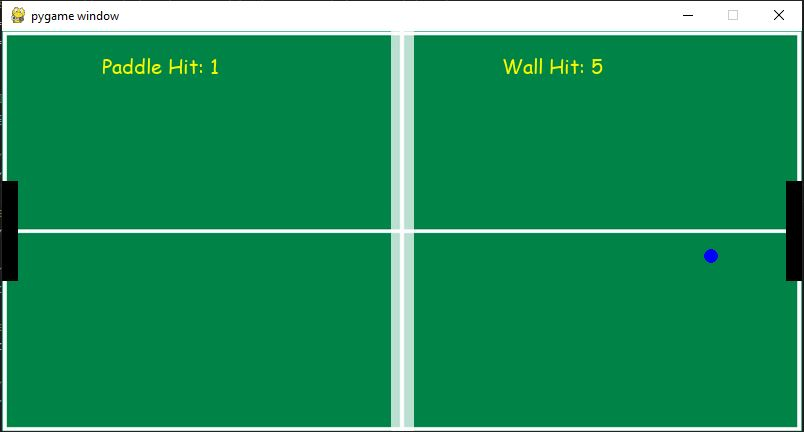

# CPSC-6520-Project-01 Game Document
# Chandni Murmu and Alex Schlesener

------------------------------------------------------------------------------------------
## Game Image

## Rules of Play
Play by yourself or with a partner! Player 1 presses the "A" key for up, and "Z" for down, while Player 2 uses the "Up" and "Down" arrows on the right side of the keyboard. Enjoy!

-------------------------------------------------------------------------------------------

## Program Versions

- OS Version: Windows 10 and MacOS

- Python Version: Python 3.11.1

- Pygame Version: pygame 2.1.3.dev8 (SDL 2.0.22, Python 3.11.1)

--------------------------------------------------------------------------------------------

## Motivation behind the game chosen: 
- Explain why you chose to build the game that you did and what inspired you.

  This assignment, we decided to re-create Pong -- one of the first computer games ever created. Considering both of us are new to the Pygame library, we thought this game would be a fun way to learn the system; fortunately, we were right! Through this project, we were able to develop a much more thorough understanding of Python, while also learning the fundamentals of game design. This list includes game loops, models, views, and controllers! 

## Reasoning behind the structure:  
- Discuss the reasoning behind the structure of your game and why you chose to implement it in the way that you did.
  
  Our game structure (visualized in the image below), consists of seven major parts: main, Controller, FrameViewer, GameLoop, Model, paddle, and pong. 
    - The main script (outside of the "Stuff" folder) starts the script -- its main purpose is to "tie together" all other parts of the game. 
    - The Controller script handles all input events (i.e. paddle movement) and game logic (i.e. ball movement).
    - The FrameViewer script displays the game on the screen (i.e. background image).
    - The GameLoop continuously updates the game state, while drawing new frames on the screen and gathering all input events. 
    - The Model script handles all game data and tracks the state of the game (i.e. tracking how many times the ball hits the paddle or the wall).
    - The "things" or "entities" within the game are handled in separate scripts: 
      - The paddle script defines all aspects of the paddles, including its color, size, and speed.
      - The pong script defines the ball's main attributes, including its color, size, and speed.
  
  The main reason for this game structure is its potential for generalization. Our goal is to use pieces of this game engine in future Pygame projects, specifically the model, view, and controller. For this reason, entities specific to this particular game (i.e. pong/paddle) are included in their own scripts. 

## Image of Classes, Functions, and Connections:

## Future Work:
- How can you further enhance the game engine elements of the game? Discuss how you can further improve the game engine and add new features to the game.

  A major way that we can further enhance our current game engine design is through the implementation of classes. This will allow for instancing to be possible, which will lead to further generalization of our code. Additionally, from a design perspective, we would love to enhance the frontend of this game, with new paddles and a scoreboard to track results. 

## Generalization: 
- Discuss how the game could be generalized to other types of games or applications.
  
  As mentioned previously, our goal is to re-use the model, view, and controller in future Pygame assignments, so we aimed to make this game as generalizable as possible. For this reason, aspects pertaining specifically to the entities in this game (i.e. pong, ball, background, etc.) are not included in the model, view, or controller.  

